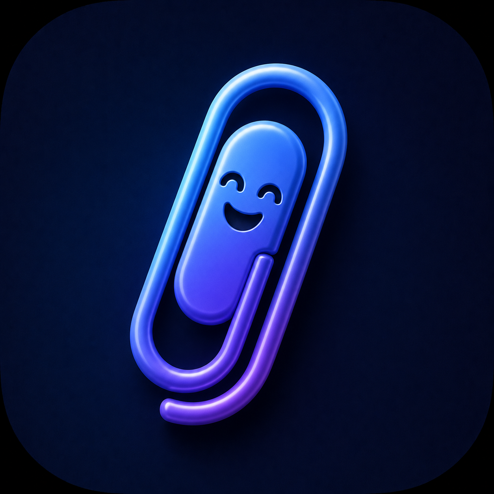
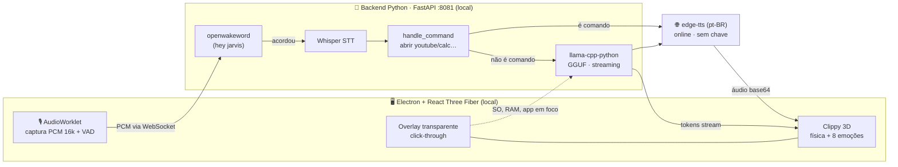

<div align="center">



# 📎 Clippy

### Um companheiro de desktop com IA que vive flutuando na sua tela — ouve, pensa, fala e reage.
#### An AI desktop companion that lives floating on your screen — it listens, thinks, talks back and reacts.

_Entidade 3D viva (React Three Fiber) · cérebro local (Whisper + llama.cpp) · voz pt‑BR · sem chave de API._<br/>
_Living 3D entity (React Three Fiber) · local brain (Whisper + llama.cpp) · pt‑BR voice · no API key._

<br/>

[](https://clippy-beige.vercel.app)


🇧🇷 [**Português**](#-português) · 🇺🇸 [**English**](#-english) · 🌐 [**clippy-beige.vercel.app**](https://clippy-beige.vercel.app)

</div>

---

<a name="-português"></a>

## 🇧🇷 Português

> **Clippy** é o nostálgico clipe de papel reimaginado como uma entidade 3D _glassmorphic_ com IA — só que agora ele roda na **sua** máquina, tem opinião sobre tudo e responde com a voz mais sarcástica do seu desktop.

### 📑 Índice

[O que é](#o-que-é) · [Demo](#-demo) · [Recursos](#-recursos) · [Os 8 humores](#-os-8-humores-do-clippy) · [Arquitetura](#-arquitetura) · [Como rodar](#-como-rodar) · [Configurar os modelos](#-configurar-os-modelos) · [Stack](#-stack) · [Estrutura](#-estrutura-do-projeto) · [Roadmap](#-roadmap) · [Licença](#-licença)

### O que é

**Clippy** é um assistente de desktop com IA que vive numa **janela transparente em tela cheia que deixa o clique passar** (`setIgnoreMouseEvents`) — ele fica sobre qualquer app ou jogo **sem nunca atrapalhar**. Você acorda ele pela **palavra-mágica** (`hey jarvis`) ou por `Ctrl+Shift+Space`, fala, e ele responde **por voz** com uma personalidade debochada e sarcástica.

O **cérebro roda localmente**: a palavra-mágica (`openwakeword`), a transcrição (Whisper) e o raciocínio (LLM GGUF via `llama.cpp`) acontecem **na sua máquina, sem nuvem e sem chave de API**. A voz usa o `edge-tts` da Microsoft — **gratuito e sem conta**, e o único pedaço que toca a rede.

Mas ele não é só uma caixa de texto. É uma **entidade 3D** que você **arrasta com física de mola** (_squash & stretch_), que **te segue com os olhos**, que fica **rosa e feliz quando você faz carinho** nele e **vermelho e foge quando você ataca o mouse** — com **8 estados emocionais** proceduralmente animados e voz que **pulsa no ritmo da própria fala** (análise FFT em tempo real).

### 🎬 Demo

> 🌐 **Veja a vitrine interativa em [clippy-beige.vercel.app](https://clippy-beige.vercel.app)** — com o mascote que segue o seu cursor.

<!-- 💡 Dica: grave um GIF do overlay flutuando sobre o desktop e troque a linha abaixo por:   -->
<div align="center"><em>🎥 GIF do overlay click-through em ação — em breve.</em></div>

### ✨ Recursos

#### 👁️ Entidade 3D orgânica (React Three Fiber)
- Corpo _glassmorphic_ com vidro real (`MeshTransmissionMaterial` + `ContactShadows` + `Environment`).
- **Física cinemática**: arrastável com _squash and stretch_ via `@use-gesture/react` + `react-spring`, ímã pras bordas e "baque" no chão com som.
- **Eye-tracking** suave: os olhos seguem o seu cursor.
- **Micro-interações**: carinho (mouse devagar) → fica rosa/feliz · susto (mouse rápido) → fica vermelho e **foge** do ponteiro. Pisca sozinho, flutua, e gira no duplo-clique.

#### 🧠 Cérebro local & privado
- **Palavra-mágica** com `openwakeword` (`hey jarvis`), forçando ONNX no Windows pra consumir pouca CPU.
- **STT local**: sua voz é transcrita pelo **Whisper** (`pywhispercpp`), rodando offline.
- **LLM local**: respostas geradas por **`llama-cpp-python`** (modelo GGUF, ex.: Qwen2.5‑Coder), com persona sarcástica e **streaming token a token** + memória curta de 5 turnos.
- **VAD** no front com `hark` — ele só envia áudio quando você realmente está falando.

#### 🗣️ Voz com presença
- **TTS pt‑BR** (`edge-tts`, voz `pt-BR-AntonioNeural`) transmitido em _chunks_ pelo WebSocket.
- **Áudio espacial** (Web Audio `PannerNode` / HRTF): a voz parece sair de onde o Clippy está na tela.
- **Lip-sync por FFT**: o corpo **pulsa no ritmo da própria voz** e a bolha mostra um visualizador de frequência ao vivo.

#### 💻 Integração profunda com o SO (Electron)
- **Contexto do sistema**: sabe seu SO, RAM livre e o **app em foco** (`active-win`) — então dá pra perguntar _"como faço X **neste** programa?"_.
- **Comandos de voz**: _"abrir youtube"_, _"abrir google"_, _"abrir calculadora"_ → executam direto no SO.
- **Atalho global** `Ctrl+Shift+Space` pra acordar de qualquer lugar.
- **System tray** + **auto-launch** no login + **electron-updater** + **Low Performance Mode** (clique direito) pra desligar o pós-processamento pesado em laptops/GPU integrada.

### 🎭 Os 8 humores do Clippy

Cada estado tem cor, expressão facial e gatilho próprios — animados por interpolação contínua (sem "pulos"):

| Humor | Cor | Quando acontece |
|---|---|---|
| 😶 **WAITING** | ⚪ branco | Ocioso, flutuando, esperando a palavra-mágica |
| 👂 **LISTENING** | 🟢 verde | Te ouvindo (olhos arregalados, vira pra bolha) |
| 🤔 **THINKING** | 🟣 roxo | O LLM está gerando a resposta |
| 🗣️ **SPEAKING** | 🔵 azul | Falando — pulsa no ritmo da voz (FFT) |
| 😱 **SCARED** | 🔴 vermelho | Mouse rápido / cutucada → **foge** do ponteiro |
| 😴 **SLEEPY** | ⚪ cinza | Olhos fechados, modo soneca |
| 😕 **CONFUSED** | 🟠 âmbar | Erro de microfone ou não entendeu nada |
| 🥰 **HAPPY** | 🩷 rosa | Você passou o mouse devagar = carinho |

### 🏗️ Arquitetura



> 🔒 **Sobre "offline":** o cérebro (palavra-mágica + Whisper + LLM) roda **100% local**, sem nuvem e sem API key. A **voz** usa o `edge-tts` da Microsoft — gratuito e sem conta, mas é o único componente que precisa de internet. Trocar por um TTS totalmente local (Piper/Coqui) está no [roadmap](#-roadmap).

### 🚀 Como rodar

**Pré-requisitos:** Windows · Python 3.10+ · Node.js 18+ · um microfone · um modelo LLM GGUF + um modelo Whisper locais.

```bash
# 1) Backend Python (servidor FastAPI/WebSocket na porta 8081)
pip install -r requirements.txt
python main.py

# 2) Dependências do frontend
npm install
cd client && npm install && cd ..

# 3) Em desenvolvimento, rode dois terminais:
#    Terminal A → cd client && npm run dev   (Vite em :5173)
#    Terminal B → npm start                  (wrapper Electron)
```

**Build de produção (.exe Windows):**

```bash
npm run dist   # build do client + electron-builder (NSIS) → dist-electron/
```

> 💡 **Performance:** o pós-processamento (Bloom + Chromatic Aberration) é pesado. **Clique direito** no Clippy → **Performance Mode: LOW** desliga os efeitos (ideal pra laptops / GPU integrada).

### 🧩 Configurar os modelos

Clippy não vem com os pesos — você aponta ele pros **seus** modelos locais. Os caminhos são lidos de variáveis de ambiente (com um _fallback_ pros caminhos antigos):

| Variável | Aponta para | Exemplo |
|---|---|---|
| `CLIPPY_LLM_MODEL` | modelo LLM `.gguf` | `Qwen2.5-Coder-14B-Instruct-Q4_K_M.gguf` |
| `CLIPPY_WHISPER_MODEL` | modelo Whisper (ggml/whisper.cpp) | `ggml-small_whisper.bin` |

```powershell
# PowerShell (Windows)
$env:CLIPPY_LLM_MODEL    = "C:\models\Qwen2.5-Coder-14B-Instruct-Q4_K_M.gguf"
$env:CLIPPY_WHISPER_MODEL = "C:\models\ggml-small_whisper.bin"
python main.py
```

A palavra-mágica (`hey jarvis`) é baixada automaticamente pelo `openwakeword` na primeira execução.

### 🛠️ Stack

| Camada | Tecnologias |
|---|---|
| **Engine 3D** | Three.js `0.183` · React Three Fiber `9` · Drei · postprocessing (Bloom / Chromatic Aberration) |
| **Frontend** | Vite `7` · React `19` · TypeScript · Tailwind `v4` · Framer Motion · Zustand · `@use-gesture` · `react-spring` · `hark` · `lucide-react` |
| **Áudio** | Web Audio API · AudioWorklet · AnalyserNode (FFT) · PannerNode (HRTF) |
| **Desktop** | Electron `40` · IPC · `electron-builder` · `electron-updater` · `active-win` |
| **Backend** | Python `3.10+` · FastAPI · WebSockets · NumPy · asyncio |
| **IA** | `openwakeword` (ONNX) · `pywhispercpp` (Whisper) · `llama-cpp-python` (GGUF) · `edge-tts` |
| **Site** | Next.js `14` (App Router) · TypeScript · Tailwind — _repo separado_ ([`Clippy-site`](https://github.com/caioross/Clippy-site)) |

### 📂 Estrutura do projeto

```
Clips/  (repo: caioross/Clippy)
├─ index.js                 ← Electron main: overlay, tray, IPC, atalho global, auto-launch
├─ main.py                  ← backend FastAPI/WS :8081  (wake → STT → comando → LLM → TTS)
├─ requirements.txt         ← dependências Python
├─ core/
│  ├─ wake.py               ← WakeWordDetector  (openwakeword, ONNX)
│  ├─ stt.py                ← SpeechToText       (Whisper / pywhispercpp)
│  ├─ llm.py                ← LanguageModel      (llama-cpp, persona, streaming)
│  └─ tts.py                ← TextToSpeech       (edge-tts, pt-BR)
├─ client/                  ← app React 19 + R3F (Vite 7, Tailwind v4)
│  ├─ src/components/        Assistant3D · PremiumBubble · AudioVisualizer · ContextMenu · Tooltip
│  ├─ src/store/             Zustand (estado + fila de áudio Web Audio/FFT/Panner)
│  └─ public/audio-processor.js   AudioWorklet (PCM 16k → WebSocket)
├─ site/                    ← landing page Next.js 14  (repo separado: caioross/Clippy-site)
├─ .github/workflows/build.yml   CI: empacota o .exe (electron-builder / NSIS)
├─ package.json             ← productName "Clippy" · appId com.clips.assistant
└─ LICENSE                  ← Apache-2.0
```

<sub>🧹 _Arquivos legados:_ `main.js` + `index.html` na raiz são um protótipo standalone antigo, e `brain.py` é o backend monolítico original — ambos foram substituídos por `index.js` e por `main.py` + `core/`.</sub>

### 🗺️ Roadmap

- [ ] 🔊 TTS 100% local (Piper / Coqui) pra fechar o ciclo offline de verdade
- [ ] 📦 Empacotar o backend Python junto com o `.exe` (hoje rodam separados)
- [ ] 🧰 Tela de configurações (escolher modelo, voz, sensibilidade do silêncio)
- [ ] 🌍 Voz e persona em mais idiomas
- [ ] 🍎 Builds pra macOS e Linux
- [ ] 🧩 Mais comandos do SO e ações de janela

### 🤝 Contribuindo

PRs e issues são bem-vindos! Achou um bug, tem uma ideia de humor pro Clippy ou quer adicionar um comando? Abra uma [issue](https://github.com/caioross/Clippy/issues) ou mande um PR.

### 📄 Licença

Distribuído sob a licença **Apache 2.0**. Veja [`LICENSE`](LICENSE).

---

<a name="-english"></a>

## 🇺🇸 English

> **Clippy** is the nostalgic paper clip reimagined as a _glassmorphic_ 3D AI entity — except now it runs on **your** machine, has an opinion about everything, and answers in the snarkiest voice on your desktop.

### What it is

**Clippy** is an AI desktop assistant living in a **fullscreen transparent click-through window** (`setIgnoreMouseEvents`) — it floats over any app or game **without ever getting in the way**. Wake it with the **wake word** (`hey jarvis`) or `Ctrl+Shift+Space`, talk, and it replies **out loud** with a snarky, sarcastic personality.

The **brain runs locally**: wake word (`openwakeword`), transcription (Whisper) and reasoning (a GGUF LLM via `llama.cpp`) all happen **on your machine — no cloud, no API key**. The voice uses Microsoft's `edge-tts` — **free and account-less**, and the only piece that touches the network.

It's more than a text box. It's a **3D entity** you **drag around with spring physics** (_squash & stretch_), that **eye-tracks your cursor**, turns **pink and happy when you pet it** and **red and flees when you poke the mouse at it** — with **8 procedurally animated emotional states** and a voice body that **pulses to the rhythm of its own speech** (real-time FFT).

### 🎬 Demo

> 🌐 **See the interactive showcase at [clippy-beige.vercel.app](https://clippy-beige.vercel.app)** — with a mascot that follows your cursor.

<!-- 💡 Tip: record a GIF of the overlay floating over your desktop and swap the line below for:   -->
<div align="center"><em>🎥 GIF of the click-through overlay in action — coming soon.</em></div>

### ✨ Features

- **Organic 3D entity (React Three Fiber):** real glass material (`MeshTransmissionMaterial` + `ContactShadows`), kinematic drag physics (squash & stretch, edge-magnet, floor "thud"), smooth cursor eye-tracking, pet/scare micro-interactions, self-blinking and a double-click spin.
- **Local & private brain:** `openwakeword` wake detection (ONNX), Whisper STT (`pywhispercpp`), `llama-cpp-python` (GGUF) responses with **token streaming** and a short 5-turn memory, plus front-end VAD (`hark`) so it only streams audio while you're actually talking.
- **Voice with presence:** pt-BR TTS (`edge-tts`) streamed over WebSocket, **spatial audio** (Web Audio `PannerNode`/HRTF) so the voice comes from where Clippy is, and **FFT lip-sync** so the body pulses and the bubble shows a live frequency visualizer.
- **Deep OS integration (Electron):** knows your OS, free RAM and focused app (`active-win`) so it can answer _"how do I do X in **this** app?"_; voice commands (_"open youtube"_, _"open calculator"_); global `Ctrl+Shift+Space` shortcut; system tray, auto-launch, electron-updater, and a **Low Performance Mode** (right-click) to kill the heavy post-processing.

### 🎭 Clippy's 8 moods

Each state has its own color, facial expression and trigger, smoothly interpolated (no jumps):

| Mood | Color | When it happens |
|---|---|---|
| 😶 **WAITING** | ⚪ white | Idle, floating, waiting for the wake word |
| 👂 **LISTENING** | 🟢 green | Hearing you (wide eyes, turns to the bubble) |
| 🤔 **THINKING** | 🟣 purple | The LLM is generating the answer |
| 🗣️ **SPEAKING** | 🔵 blue | Talking — pulses to its voice (FFT) |
| 😱 **SCARED** | 🔴 red | Fast mouse / poke → **flees** the pointer |
| 😴 **SLEEPY** | ⚪ gray | Eyes closed, nap mode |
| 😕 **CONFUSED** | 🟠 amber | Mic error or it understood nothing |
| 🥰 **HAPPY** | 🩷 pink | You moved the mouse slowly = petting |

### 🚀 How to run

**Prerequisites:** Windows · Python 3.10+ · Node.js 18+ · a microphone · local GGUF LLM + Whisper models.

```bash
# 1) Python backend (FastAPI/WebSocket server on port 8081)
pip install -r requirements.txt
python main.py

# 2) Frontend dependencies
npm install
cd client && npm install && cd ..

# 3) In dev, run two terminals:
#    Terminal A → cd client && npm run dev   (Vite on :5173)
#    Terminal B → npm start                  (Electron wrapper)

# Production build (Windows .exe):
npm run dist
```

**Point Clippy at your models** with environment variables (they fall back to the original paths if unset):

| Variable | Points to |
|---|---|
| `CLIPPY_LLM_MODEL` | your `.gguf` LLM model (e.g. Qwen2.5-Coder) |
| `CLIPPY_WHISPER_MODEL` | your Whisper (ggml/whisper.cpp) model |

> 🔒 **About "offline":** the brain (wake word + Whisper + LLM) is **100% local**, no cloud, no API key. The **voice** uses Microsoft's `edge-tts` — free and account-less, but the one component that needs internet. A fully-local TTS (Piper/Coqui) is on the roadmap.

### 🛠️ Stack & layout

Frontend: Vite 7 + React 19 + TypeScript + Tailwind v4 + Framer Motion; 3D via Three.js + React Three Fiber + Drei + postprocessing, state in Zustand, drag via `@use-gesture` + `react-spring`. Audio: Web Audio API + AudioWorklet + Analyser (FFT) + Panner (HRTF). Desktop: Electron 40 + IPC + electron-builder/updater + active-win. Backend: Python 3.10+ + FastAPI + WebSockets with `openwakeword` / Whisper / `llama-cpp-python` / `edge-tts`. The landing page lives in `site/` (separate repo, Next.js 14). See the architecture diagram and file tree in the Portuguese section above.

### 📄 License

Released under the **Apache 2.0** license. See [`LICENSE`](LICENSE).

---

<div align="center">

**📎 Clippy** — _feito com 💜 por [Caio](https://github.com/caioross). Não, ele não te vê._<br/>
<sub>Made with 💜 — and no, it can't see you.</sub>

[🌐 Site](https://clippy-beige.vercel.app) · [💻 Código](https://github.com/caioross/Clippy) · [🐛 Issues](https://github.com/caioross/Clippy/issues)

</div>
