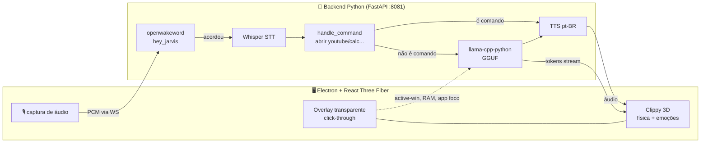

<div align="center">


# 📎 Clippy

### Um companheiro de desktop com IA — vive flutuando na sua tela, ouve, conversa e reage
### An AI desktop companion — floats on your screen, listens, talks back and reacts

_3D vivo (React Three Fiber) · voz local (Whisper + llama.cpp + TTS) · 100% offline, sem API key._<br/>
_Living 3D (React Three Fiber) · local voice (Whisper + llama.cpp + TTS) · 100% offline, no API key._

<br/>


</div>

🇧🇷 [**Português**](#-português) · 🇺🇸 [**English**](#-english)

---

## 🇧🇷 Português
<a name="-português"></a>

### O que é

**Clippy** é um assistente de desktop com IA que vive numa **janela transparente em tela cheia que deixa o clique passar** (`setIgnoreMouseEvents`) — ele fica sobre qualquer app ou jogo sem atrapalhar. Você acorda ele por **palavra-mágica** (`hey_jarvis`) ou `Ctrl+Shift+Space`, fala, e ele responde por voz com uma personalidade debochada e sarcástica. Tudo roda **localmente**: transcrição (Whisper), raciocínio (LLM GGUF via llama.cpp) e fala (TTS) — sem nuvem, sem chave de API.

Ele não é só uma caixa de texto: é uma entidade 3D glassmorphic que você **arrasta com física de mola** (squash & stretch), que **segue seu cursor com os olhos**, que fica **rosa e feliz se você passa devagar nele** ou **vermelho e fugindo se você ataca rápido** — com 8 estados emocionais proceduralmente animados.

### Recursos

#### 👁️ Visualização 3D orgânica (React Three Fiber)
- Entidade glassmorphic (`MeshTransmissionMaterial` + `ContactShadows`).
- **Física cinemática**: arrastável, com "squash and stretch" via `@use-gesture/react` + `react-spring`.
- **Eye tracking** suave do cursor.
- **Micro-interações**: faz carinho → fica rosa/feliz · assusta → fica vermelho e foge do mouse.
- **8 expressões** transicionáveis, regidas pelo que ele está fazendo/dizendo.

#### 🧠 Inteligência local & offline
- **Wake word** com `openwakeword`, otimizado pra consumir mínimo de CPU.
- **STT + LLM locais**: voz transcrita por `whisper`, respostas geradas por `llama-cpp-python` (modelo GGUF, ex.: Qwen2.5-Coder).
- **Token streaming**: texto flui na bolha de diálogo (`Framer Motion`) token a token.
- **TTS local** com avaliação de frequência FFT em tempo real — Clippy pulsa no ritmo da própria voz.

#### 💻 Integração profunda com o SO (Electron)
- **Contexto do sistema**: sabe seu SO, RAM livre e o **app em foco** (`active-win`) — responde "como faço X *neste* programa?".
- **Comandos**: "abrir youtube", "abrir calculadora" → executa direto no SO.
- **Atalho global** `Ctrl+Shift+Space` pra acordar.
- **System tray** com modos de performance e auto-launch no login.

### Como rodar

```bash
# 1. Backend Python (servidor FastAPI/WebSocket na porta 8081)
pip install -r requirements.txt
python main.py

# 2. Frontend + Electron
npm install
cd client && npm install && cd ..

# 3. Dois terminais em dev:
#    A → cd client && npm run dev   (Vite na :5173)
#    B → npm start                  (wrapper Electron)
```

**Build de produção (.exe Windows):** `npm run dist`

> ⚠️ **Anomalia conhecida:** `main.py` tem caminhos de modelo **hardcoded** apontando para `E:\Trebuchet\models\` (`Qwen2.5-Coder-14B-…gguf`, `ggml-small_whisper.bin`). Ajuste esses caminhos pra apontar pro seu modelo GGUF + Whisper local antes de rodar.

> 💡 **Performance:** o pipeline de pós-processamento (Bloom / Chromatic Aberration) é pesado. Há um **Low Performance Mode** — clique direito no assistente pra alternar (ideal pra laptops / GPU integrada).

### Arquitetura



### Stack

- **Frontend:** Vite + React + TypeScript + Tailwind v4 + Framer Motion.
- **Engine 3D:** Three.js + React Three Fiber + Drei (Zustand pra estado + fila de Web Audio).
- **Desktop:** Electron 40 + IPC + `electron-builder` + `electron-updater` + `active-win`.
- **Backend:** Python 3.10+ + FastAPI + WebSockets + NumPy + asyncio; `openwakeword`, `whisper`, `llama-cpp-python`, TTS.

### Estrutura

```
Clips/
├── index.js / main.js          ← processo principal Electron (overlay, tray, IPC)
├── index.html                  ← shell
├── main.py                     ← backend FastAPI/WS (wake→STT→cmd→LLM→TTS)
├── brain.py                    ← lógica de orquestração
├── core/
│   ├── wake.py                 ← WakeWordDetector (openwakeword)
│   ├── stt.py                  ← SpeechToText (Whisper)
│   ├── llm.py                  ← LanguageModel (llama-cpp, persona sarcástica)
│   └── tts.py                  ← TextToSpeech (pt-BR)
├── client/                     ← app React + R3F (Vite)
├── dist-electron/              ← saída do electron-builder
├── package.json                ← productName "Clippy", appId com.clips.assistant
└── requirements.txt
```

---

## 🇺🇸 English
<a name="-english"></a>

### What it is

**Clippy** is an AI desktop assistant living in a **fullscreen transparent click-through window** (`setIgnoreMouseEvents`) — it floats over any app or game without getting in the way. Wake it with a **wake word** (`hey_jarvis`) or `Ctrl+Shift+Space`, talk, and it replies out loud with a snarky, sarcastic personality. Everything runs **locally**: transcription (Whisper), reasoning (a GGUF LLM via llama.cpp) and speech (TTS) — no cloud, no API key.

It's more than a text box: a glassmorphic 3D entity you **drag around with spring physics** (squash & stretch), that **eye-tracks your cursor**, turns **pink and happy when petted** or **red and fleeing when poked fast** — with 8 procedurally animated emotional states.

### Features

- **Organic 3D (React Three Fiber):** glassmorphic material, kinematic drag physics, cursor eye-tracking, pet/scare micro-interactions, 8 transitionable expressions.
- **Local & offline brain:** `openwakeword` wake detection, Whisper STT, `llama-cpp-python` (GGUF) responses with token streaming into a Framer Motion bubble, local TTS with real-time FFT so Clippy pulses to its own voice.
- **Deep OS integration (Electron):** knows your OS, free RAM and focused app (`active-win`) so it can answer "how do I do X in *this* app?"; voice commands ("open youtube"); global `Ctrl+Shift+Space` shortcut; system tray with performance modes and auto-launch.

### How to run

```bash
# 1. Python backend (FastAPI/WebSocket server on port 8081)
pip install -r requirements.txt
python main.py

# 2. Frontend + Electron
npm install
cd client && npm install && cd ..

# 3. Two dev terminals:
#    A → cd client && npm run dev   (Vite on :5173)
#    B → npm start                  (Electron wrapper)
```

**Production build (Windows .exe):** `npm run dist`

> ⚠️ **Known quirk:** `main.py` hardcodes model paths under `E:\Trebuchet\models\` (`Qwen2.5-Coder-14B-…gguf`, `ggml-small_whisper.bin`). Point these at your own local GGUF + Whisper model before running.

> 💡 **Performance:** the post-processing pipeline (Bloom / Chromatic Aberration) is heavy — right-click the assistant to toggle **Low Performance Mode** (great for laptops / integrated GPUs).

### Stack & layout

Frontend: Vite + React + TypeScript + Tailwind v4 + Framer Motion; 3D via Three.js + React Three Fiber + Drei + Zustand. Desktop: Electron 40 + IPC + electron-builder/updater + active-win. Backend: Python 3.10+ + FastAPI + WebSockets, with openwakeword / Whisper / llama-cpp-python / TTS. See the architecture diagram and file tree in the Portuguese section above.

---

<div align="center">

*Parte do ecossistema de projetos de **Caio**.*

</div>
